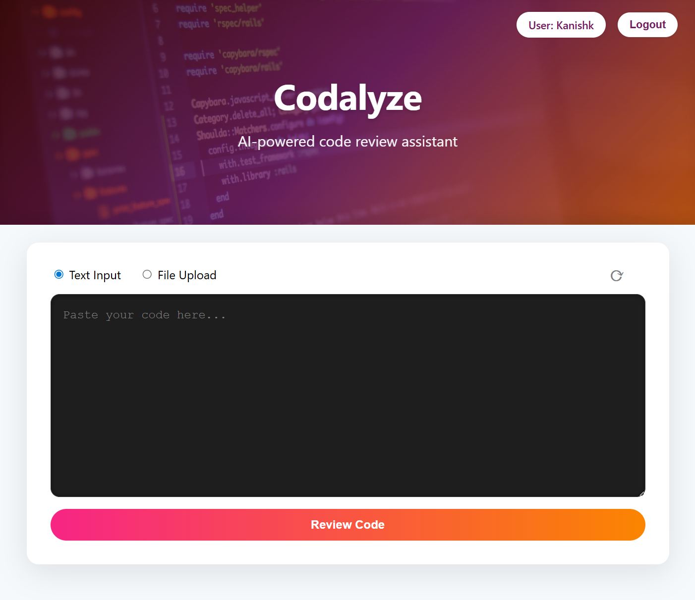
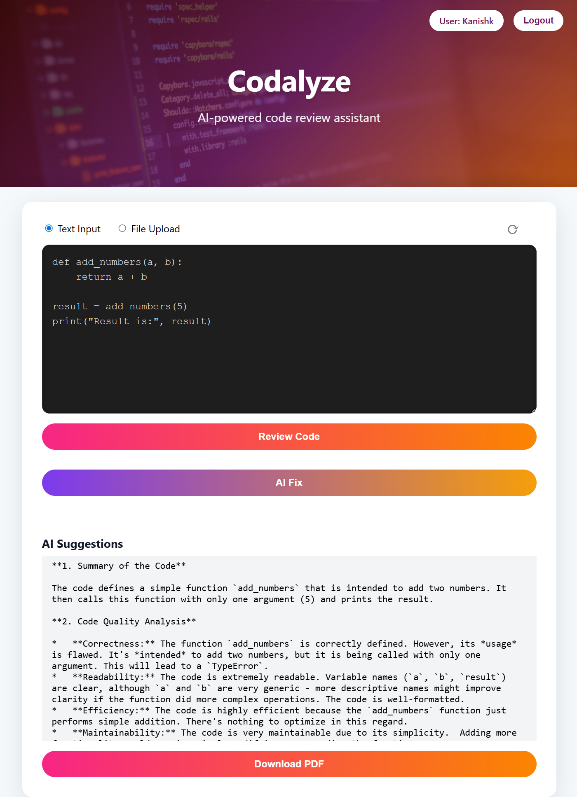

# Codalyze - AI-Powered Code Review Assistant
Codalyze is an intelligent code review platform that uses AI to analyze, review, and automatically fix code.
It helps developers catch mistakes, improve code quality, and generate suggestions for better coding practices in real-time.

---

## 📸 Screenshots

### 🔹 Home Page


### 🔹 AI Suggestions


---

## 🚀 Features

- 🧠 AI-Powered Code Review: Detects errors, bad practices, and improvements using AI.
- 🔧 AI Auto-Fix: Automatically generates corrected versions of the input code.
- 📝 Multiple Input Methods: Supports text input and .py file upload for review.
- 📄 PDF Export: Downloads AI-generated code reviews and corrections as PDF reports.
- 🔐 User Authentication: Secure registration and login with Flask-Bcrypt encryption.
- 🖥️ Modern UI: Professional, intuitive interface inspired by Codacy and SonarQube.
- 🔁 Refresh Button: Clears previous code, suggestions.

---

## 🛠️ Tech Stack
- **Frontend:** HTML, CSS, JavaScript
- **Backend:** Python (Flask)
- **Database:** PostgreSQL (via SQLAlchemy)
- **AI Model:** Google Gemini 2.0 Flash Lite (via API)
- **Deployment:** Render

---

## ⚙️ Installation Guide

### Step 1️⃣: Clone the Repository
```bash
git clone https://github.com/yourusername/codalyze.git
cd codalyze
```
Step 2️⃣: Create a Virtual Environment
```bash
# Create virtual env
python3 -m venv venv

# Activate on Unix or Mac
source venv/bin/activate

#Activate on Windows
venv\Scripts\activate
```
Step 3️⃣: Install Dependencies
```bash
pip install -r requirements.txt
```
Step 4️⃣: Set up Environment Variables
```bash
GEMINI_API_KEY=your_gemini_api_key
SECRET_KEY=your_flask_secret_key
POSTGRES_HOST=localhost
POSTGRES_PORT=5432
POSTGRES_DB=codalyze_db
POSTGRES_USER=your_postgres_username
POSTGRES_PASSWORD=your_postgres_password
```
⚠️ Note: Replace these values with your actual API keys and database credentials.

Step 5️⃣: Run the Application
```bash
python app.py
```
Visit the app at: http://localhost:5000